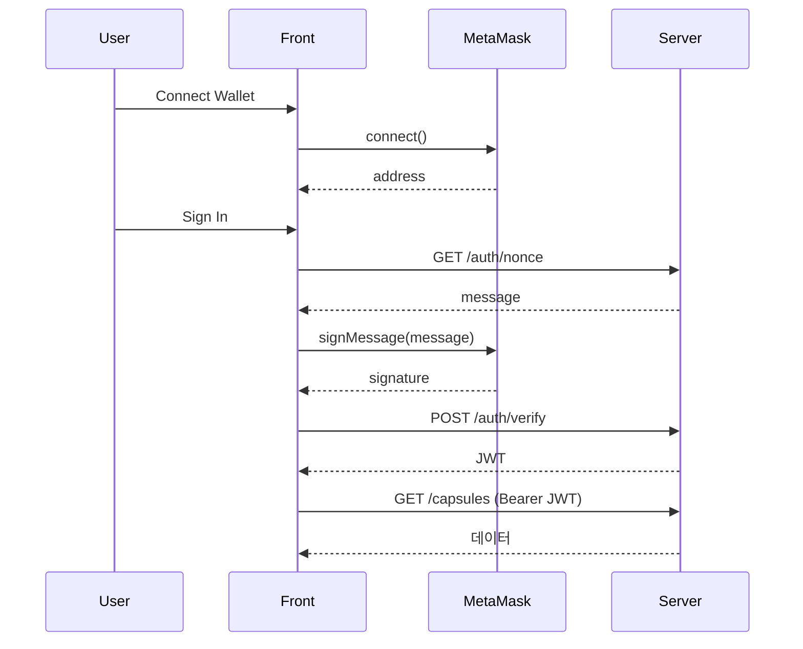

# Providers

앱 전역 Provider. `main.tsx`에서 `AppProviders` 한 번만 마운트.

```
src/
├── config/wagmi.ts          ← wagmi 설정 (chains, connectors)
└── providers/
    ├── app-providers.tsx    ← Provider 조합·순서
    ├── wallet-provider.tsx  ← wagmi → useWallet() context
    ├── alert-provider.tsx   ← useAlert() 토스트
    └── README.md
```

---

## 연결 흐름

```
main.tsx
  └─ AppProviders
       ├─ WagmiProvider          (config/wagmi.ts)
       ├─ QueryClientProvider
       └─ WalletProvider
            └─ AlertProvider
                 └─ RouterProvider → 앱
```

UI(navigation 등)는 **`useWallet()`** (`src/hooks/use-wallet.ts`)만 사용. wagmi 직접 import X.

알림은 **`useAlert()`** (`src/hooks/use-alert.ts`) 사용.

---

## Provider 순서 (중요)

```
WagmiProvider
  └─ QueryClientProvider
       └─ WalletProvider
            └─ AlertProvider
                 └─ children
```

| 순서 | 이유 |
|------|------|
| WagmiProvider 바깥 | wagmi hook 사용 가능 영역 정의 |
| QueryClientProvider 그 안 | wagmi가 React Query 사용 |
| WalletProvider 그 안 | `useAccount`, `useConnect` 등 hook 사용 |
| AlertProvider | 전역 토스트 — 지갑·API 에러 등 UI 알림 |

`WalletProvider`를 `WagmiProvider` 밖에 두면 hook context 에러.

---

## 파일

### `app-providers.tsx`

- 전역 Provider 진입점
- 새 Provider(RainbowKit, Theme, Auth 등) 추가 시 **여기서** 감싸기

### `wallet-provider.tsx`

- wagmi hook → Capsule `WalletContext`
- 제공: `connect`, `disconnect`, `getConnectButtonLabel`, `wallet` 상태
- `wallet`: `status`, `address`, `chainName`, `error`

### `alert-provider.tsx`

- `alert({ variant, title, description, duration })` — 우측 상단 토스트
- `dismiss(id)` — 수동 닫기
- 인라인 UI는 `src/components/ui/alert.tsx`의 `<Alert />` 사용

---

## 수정할 때

| 목적 | 위치 |
|------|------|
| chain / connector | `src/config/wagmi.ts` |
| Provider 추가·순서 | `app-providers.tsx` |
| 지갑 API·표시 로직 | `wallet-provider.tsx` |
| 토스트 알림 | `alert-provider.tsx` + `useAlert()` |
| nav 버튼 UI | `features/navigation/components/wallet-connect-button.tsx` |

---

## 서버 auth (예정)

지갑 연결과 서버 로그인은 별개. 추후 `AuthProvider` 추가 예정:



---

## TODO

- [ ] RainbowKitProvider
- [x] connect 에러 toast (`useAlert`)
- [x] disconnect 드롭다운 (주소 복사, explorer) — `wallet-profile-menu.tsx`
- [ ] AuthProvider (SIWE)
